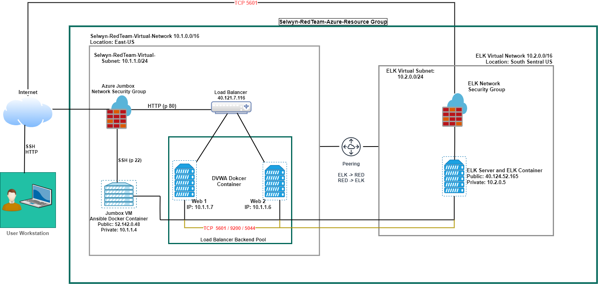
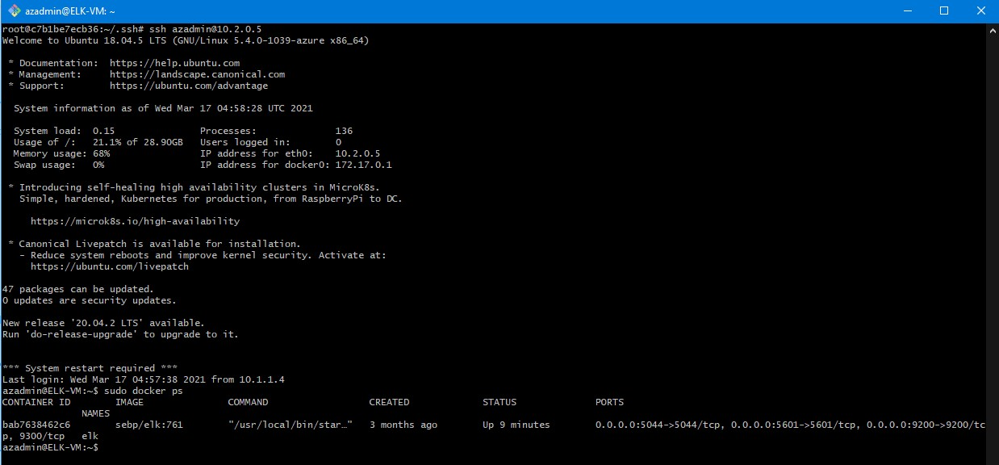

# Project1
## Automated ELK Stack Deployment

The files in this repository were used to configure the network depicted below.



These files have been tested and used to generate a live ELK deployment on Azure. They can be used to either recreate the entire deployment pictured above. Alternatively, select portions of the *ansible* *yml* and *config* *file* may be used to install only certain pieces of it, such as Filebeat.

- [Ansible Configuration](Ansible/ansible.cfg)
- [Web Server Installation](https://github.com/selwyn-adams/Project1.git/Ansible/apache2_install_webserver.yml)
- [Docker Playbook](https://github.com/selwyn-adams/Project1.git/Ansible/docker-playbook.yml)
- [ELK Playbook](https://github.com/selwyn-adams/Project1.git/Ansible/elk.yml)
- [Ansible Hosts](https://github.com/selwyn-adams/Project1.git/Ansible/hosts)
- [Python 3 Playbook](https://github.com/selwyn-adams/Project1.git/Ansible/pythn3-playbook.yml)
  

This document contains the following details:
- Description of the Topology
- Access Policies
- ELK Configuration
  - Beats in Use
  - Machines Being Monitored
- How to Use the Ansible Build


### Description of the Topology

The main purpose of this network is to expose a load-balanced and monitored instance of DVWA, the D*mn Vulnerable Web Application.

Load balancing ensures that the application will be highly avaialable, in addition to restricting access to the network.
- What aspect of security do load balancers protect? 

Load balancers protects Web security becasue of its default secure nature of zero trust network security, which means that Private and public IPs are closed to inbound traffic unless explicitly set in the Network Security Groups inbound access lists. It also protects Availbility of the services/ servers behinf\d the load balancer.  

- What is the advantage of a jump box? 

In a cloud environment the jump box allows an admin to securley connect to devices that are on seperate networks and different security zones thereby providing  hardedned layer of security. In addition the jump box itself is hardened box that allows only specific users/IPs to connect and is monitored for any breaches to the box itself. The box can also be used for automation by using yml scripts to acheive this.

Integrating an ELK server allows users to easily monitor the vulnerable VMs for changes to the *data* and system *logs*.

- What does Filebeat watch for? *Filebeat monitors the log files or locations that you specify, collects log events, and forwards them either to Elasticsearch or Logstash for indexing.*

- What does Metricbeat record? *Metricbeat takes the metrics and statistics that it collects and ships them to the output that you specify, such as Elasticsearch or Logstash.*

The configuration details of each machine may be found below.
_Note: Use the [Markdown Table Generator](http://www.tablesgenerator.com/markdown_tables) to add/remove values from the table_.

| Name     		| Function   	| IP Address 		    	| Operating System |
|-----------------------|---------------|-------------------------------|------------------|
| Jump Box 		| Gateway    	| 52.142.0.48 / 10.1.1.4	| Linux            |
| Web 1    		| Web Server  	| 10.1.1.6   		     	| Linux            |
| Web 2    		| Web Server 	| 10.1.1.7  			| Linux            |
| ELK      		| ELK Server 	| 10.2.0.5            		| Linux            |
| Load Balancer		| Load Balancer | External Static IP		| Linux		   |
| User Workstation   	| Access        | Pubic IP			| Windows	   |

### Access Policies

The machines on the internal network are not exposed to the public Internet. 

Only the *ELK*  machine can accept connections from the Internet. Access to this machine is only allowed from the following IP addresses:
- User Workstation: IP 99.233.X.X via TCP 5601

Machines within the network can only be accessed by *Jump* *Box*.
- _TODO: Which machine did you allow to access your ELK VM? What was its IP address?_

- *Jump* *Box* machine from internal IP: 10.1.1.4 via SSH on port 22
- *User* *Workstation* public IP via TCP on port 5601

A summary of the access policies in place can be found in the table below.

| Name     		| Publicly Accessible | Allowed IP Addresses 				|
|-----------------------|---------------------|-------------------------------------------------|
| Jump Box 		| 	YES	      | User Worksation IP via SSH on port 22   	|
| Web 1         	| 	NO            | Jump Box IP: 10.1.1.4 via SSH on RCP port 22	|
| Web 2         	| 	NO            | Jump Box IP: 10.1.1.4 via SSH on RCP port 22	|
| Load Balancer        	| 	NO            | User Workstation IP via port 80 HTTP		|
| ELK Server         	| 	NO            | User Workstation IP using TCP 5601		|


### Elk Configuration

Ansible was used to automate configuration of the ELK machine. No configuration was performed manually, which is advantageous because _as an Admin or DevOps engineer Ansibile eliminates the need to write custom code to automate and orhestrate systems by allowing for simple Ansible playbook scripting that undestadn how to get your systems (hardware and software) configured and prepared for use . This allows for quick and easy deployments of applications._

The playbook implements the following tasks:
 ```
- name: Configure Elk VM with Docker
  hosts: elkservers
  remote_user: sysadmin
  become: true
  tasks:
 ```
    # Use apt module
    - name: Install docker.io
      apt:
        update_cache: yes
        force_apt_get: yes
        name: docker.io
        state: present
 ```
      # Use apt module
    - name: Install python3-pip
      apt:
        force_apt_get: yes
        name: python3-pip
        state: present
 ```
      # Use pip module (It will default to pip3)
    - name: Install Docker module
      pip:
        name: docker
        state: present
 ```
      # Use command module
    - name: Increase virtual memory
      command: sysctl -w vm.max_map_count=262144
 ```
      # Use docker_container module
    - name: download and launch a docker elk container
      docker_container:
        name: elk
        image: sebp/elk:761
        state: started
        restart_policy: always
        # Please list the ports that ELK runs on
        published_ports:
          -  5601:5601
          -  9200:9200
          -  5044:5044

The following screenshot displays the result of running `docker ps` after successfully configuring the ELK instance.



### Target Machines & Beats
This ELK server is configured to monitor the following machines:
 - Web1 : 10.1.1.6
 - Web2 : 10.1.1.7

We have installed the following Beats on these machines:
 - ELK Server, Web1 and Web2
 - The ELK Stack Installed are: _FileBeat and MetricBeat_

These Beats allow us to collect the following information from each machine:
 - Filebeat:    _log events_
 - Metricbeat:  _metrics and system statistics_

### Using the Playbook
In order to use the playbook, you will need to have an Ansible control node already configured. Assuming you have such a control node provisioned: 

SSH into the control node and follow the steps below:
- Copy the [ELK Playbook](https://github.com/selwyn-adams/Project1.git/Ansible/elk.yml file to the ansible folder of your control node.
- Update the elk.yml file to include 
- Run the playbook, and navigate to ____ to check that the installation worked as expected.

_TODO: Answer the following questions to fill in the blanks:_
- _Which file is the playbook? Where do you copy it?_
	- Answer: The elk.yml file is the playbook file. It is by ansible  and has a .yml extension. You copy this file to your ansible folder found in etc/ansible.

- _Which file do you update to make Ansible run the playbook on a specific machine? How do I specify which machine to install the ELK server on versus which to install Filebeat on?_ 
	- Answer: You update the ansible.cfg file found in /etc/ansible in order to run on a specific machine
- _Which URL do you navigate to in order to check that the ELK server is running?
	- Answer:  _http://[your.ELK-VM.External.IP]:5601/app/kibana_
	
_As a **Bonus**, provide the specific commands the user will need to run to download the playbook, update the files, etc._
